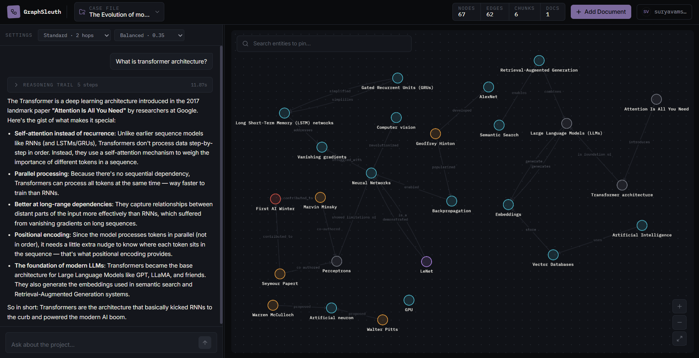

# GraphSleuth

Turn documents into living knowledge graphs - extract entities, map relationships, and reason across your documents with full traceability. Every answer streams back with the exact entities, edges, and source chunks that produced it.



## What it does

Upload documents into a project, and GraphSleuth:

1. **Extracts** entities and relationships from raw text using an LLM-driven extraction pipeline, with embedding-based deduplication so the same entity mentioned across chunks resolves to one node.
2. **Builds a graph** of typed nodes (entities) and directed, relation-labeled edges, each traceable back to the source chunk it came from.
3. **Answers questions** through a Graph RAG agent that finds relevant entry points via vector search, performs guided multi-hop traversal (beam search steered by query relevance) to gather supporting context, and streams a synthesized answer token-by-token over SSE.
4. **Shows its work**: every answer comes with a step-by-step reasoning trace that the frontend renders as an interactive, highlighted subgraph.

The chat agent is also history-aware: it routes each question to either a fresh graph traversal or a lightweight answer from recent conversation context, so obvious follow-ups don't re-trigger a full retrieval pass.

## Architecture

```
Raw File → Text Extraction → Chunking → Entity/Relation Extraction → Graph Population

Question → Router (graph vs. history) → Entry-node search → Guided graph
           traversal → Chunk scoring → Context assembly → Streamed synthesis
```
```
├── Dockerfile
├── README.md
├── amplify.yml
├── apps
│   ├── __init__.py
│   ├── api
│   │   ├── api
│   │   │   ├── routes
│   │   │   │   ├── chat.py
│   │   │   │   ├── documents.py
│   │   │   │   ├── graph.py
│   │   │   │   ├── health.py
│   │   │   │   ├── projects.py
│   │   │   │   └── query.py
│   │   │   └── schemas
│   │   │       ├── chat.py
│   │   │       ├── documents.py
│   │   │       ├── graph.py
│   │   │       ├── projects.py
│   │   │       └── query.py
│   │   ├── app.py
│   │   ├── core
│   │   │   ├── async_engine.py
│   │   │   ├── auth.py
│   │   │   ├── chat_store.py
│   │   │   ├── project_context.py
│   │   │   └── projects_store.py
│   │   └── dependencies.py
│   └── web/
│
├── engine
│   ├── agent
│   │   ├── prompts.py
│   │   ├── reasoner.py
│   │   └── reasoner_async.py
│   ├── client.py
│   ├── client_async.py
│   ├── embeddings
│   │   └── encoder.py
│   ├── extraction
│   │   ├── extractor.py
│   │   ├── prompts.py
│   │   └── schemas.py
│   ├── graph
│   │   ├── knowledge_graph.py
│   │   └── traversal.py
│   ├── ingestion
│   │   ├── chunking.py
│   │   ├── loaders.py
│   │   └── pipeline.py
│   ├── models
│   │   ├── __init__.py
│   │   ├── document.py
│   │   ├── edge.py
│   │   └── node.py
│   └── ports
│       ├── graph_store.py
│       └── vector_store.py
├── main.py
├── pyproject.toml
├── storage
│   ├── postgres
│   │   ├── graph_store.py
│   │   └── vector_store.py
│   ├── schema.sql
│   └── supabase
│       ├── client.py
│       ├── file_store.py
│       ├── graph_store.py
│       └── vector_store.py
├── tests
│   └── encoder_test.py
└── uv.lock
```
**Backend**: Python + FastAPI
- `engine/` - framework-agnostic core: knowledge graph, traversal engine, extraction pipeline, ingestion pipeline. Depends only on small `Protocol`-based ports (`GraphStore`, `VectorStore`), so storage is swappable (Supabase/Postgres implementations included).
- `apps/api/` - FastAPI app wiring routes, auth, per-project dependency caching, and an `AsyncEngine` that wraps the synchronous graph core in `asyncio.to_thread` calls for a non-blocking API.
- Multi-project, multi-tenant: every graph, vector index, and chat history is scoped by `project_id`, with public/private visibility and owner-only write access enforced at the dependency layer.

**Storage**: Postgres/Supabase with pgvector for embeddings, SQL tables for nodes/edges/chunks/documents/reasoning traces.

**Frontend**: React
- Split-pane workspace: chat on one side, an interactive force-directed graph viewer on the other.
- Asking a question live-highlights the exact nodes/edges/chunks that produced the answer.
- Click any entity to pivot the graph to its local neighborhood.

## Key design details

- **Guided (beam-search) traversal**: instead of exhaustive BFS, each hop scores neighbors against the query embedding and keeps only the top-`beam_width` candidates above a relevance threshold bounding traversal cost on dense graphs while staying query-relevant.
- **Confidence scoring**: a weighted blend of entry-node similarity (60%) and retrieved-chunk similarity (40%), degrading gracefully when either signal is missing.
- **Entity deduplication**: extraction runs alias matching → substring/token-overlap matching → embedding cosine similarity, in that order, before creating a new node, reducing duplicate entities from repeated LLM extraction calls.
- **Full reasoning traceability**: every trace persists its entry nodes, visited nodes, traversed edges, and source chunks, so any past answer's evidence can be replayed and visualized later.

## Tech stack

FastAPI, Python asyncio, OpenAI-compatible LLM client (or local Ollama), Supabase/Postgres + pgvector, React, Server-Sent Events.

## Running locally

```bash
# Backend
uv sync
uvicorn apps.api.app:app --reload

# Frontend
cd apps/web
npm install
npm run dev
```
